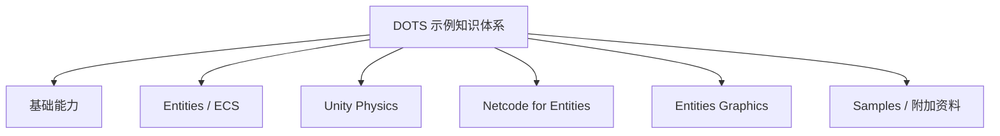
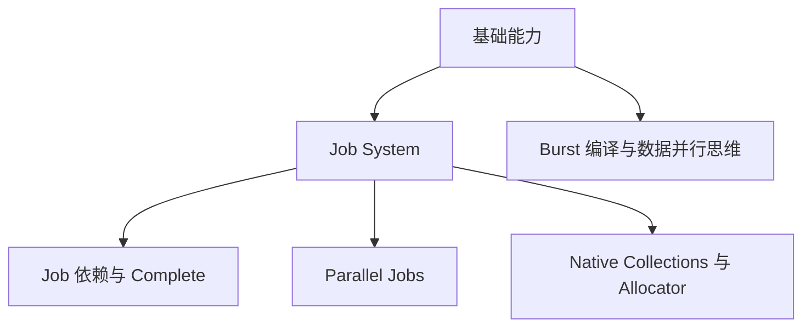
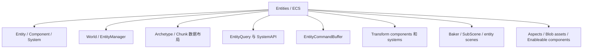
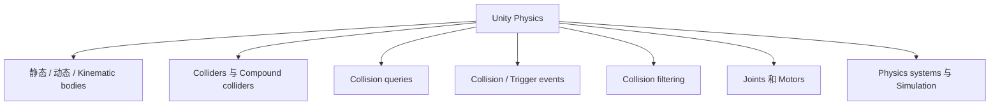
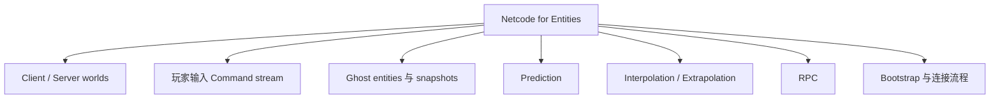
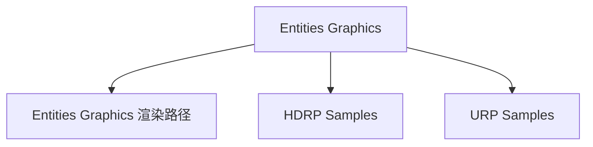
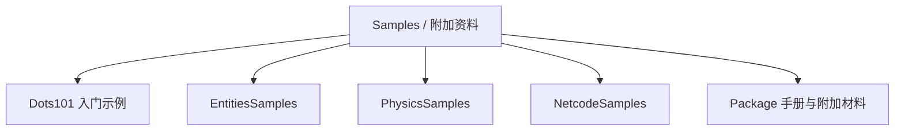

# DOTS 知识架构图

这张图把本仓库中的 DOTS 学习内容整理成从基础并行、ECS 数据建模，到 Physics、Netcode 和 Graphics 示例的知识路径。核心 DOTS / Unity 术语保留英文，方便对照官方 Package 手册、示例代码和 API。

## 基础能力

## Entities / ECS

## Unity Physics

## Netcode for Entities

## Entities Graphics

## Samples 与附加资料

## 跨模块关系

- Job System 支撑 Entities / ECS 的并行执行。
- Entities / ECS 是 Physics、Netcode 和 Graphics 示例的数据基础。
- Unity Physics 的模拟状态可以参与 Netcode 同步。
- Entities Graphics 使用 ECS 中的批量渲染数据。

## 建议阅读路径

1. 先读 [UnityJobSystem101.md](UnityJobSystem101.md)，理解 `Job`、依赖、并行执行和 `Native Collections`。
2. 再读 [UnityEntities101.md](UnityEntities101.md)，建立 `Entity`、`Component`、`System`、`World`、`Archetype`、`Chunk` 和 `Baker` 的整体模型。
3. 需要物理模拟时读 [UnityPhysics101.md](UnityPhysics101.md)，重点关注 bodies、colliders、collision queries、events、filtering、joints 和 Physics systems。
4. 需要多人联网时读 [UnityNetcodeforEntities101.md](UnityNetcodeforEntities101.md)，重点关注 `Ghost`、`Prediction`、`Interpolation`、`RPC`、client/server worlds 和连接流程。
5. 回到 [README.md](README.md) 中的 samples 索引，按目标功能进入 `EntitiesSamples`、`PhysicsSamples`、`NetcodeSamples` 或 `GraphicsSamples` 查看完整示例。

## 图例说明

- 实线表示主要学习分支。
- 虚线表示模块之间的依赖或常见组合关系。
- 图中的英文术语是 DOTS / Unity 的关键概念，建议在阅读代码和 Package 手册时保持英文对照。
